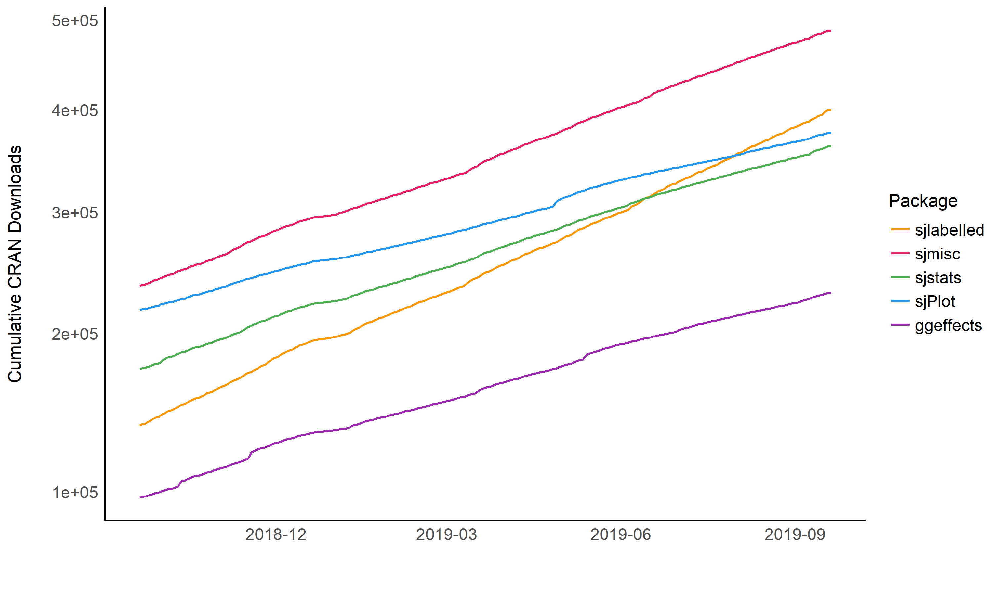

# strengejacke

Wrapper to quickly load the sj-packages. The package checks for updates
at each startup.

Usage:

``` r
library(strengejacke)
#> # Attaching packages (red = needs update)
#> * ggeffects  0.12.0   * sjlabelled 1.1.2 
#> * sjmisc     2.8.1    * sjstats    0.17.6     
#> * sjPlot     2.7.1    * esc        0.5.0      
#> 
#> Update packages in red with 'sj_update()'.
```

## Installation

This package is not on CRAN. To install the package, type following
commands into the R console:

``` r
library(devtools)
devtools::install_github("strengejacke/strengejacke")
```

## Downloads

### Cumulative downloads


